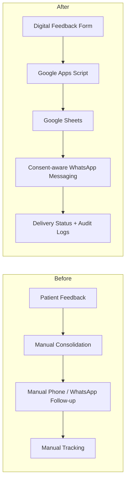
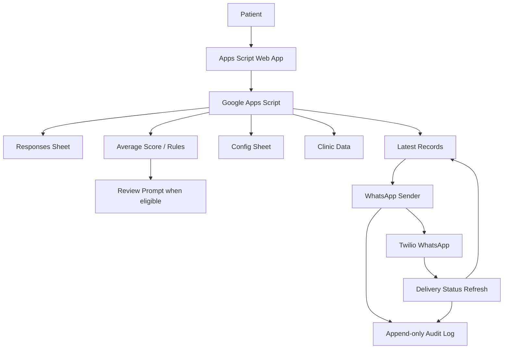

# Healthcare Feedback Automation Case Study

A sanitized case study of a healthcare workflow automation project that integrated digital feedback collection, Google Sheets, Google Apps Script, and WhatsApp messaging to reduce manual follow-up work and improve operational consistency.

> **Portfolio case study only.** Production source code, client data, phone numbers, credentials, and proprietary implementation details are intentionally excluded.

## Project at a glance

- **Domain:** Healthcare operations
- **Solution type:** Workflow automation and customer engagement
- **Primary platform:** Google Apps Script + Google Sheets
- **Messaging integration:** Twilio WhatsApp
- **Focus:** Feedback collection, consent-aware messaging, batching, delivery tracking, logging, recovery, and staff enablement
- **Project model:** Process analysis → workflow redesign → implementation → deployment → training/support

## The problem

The existing workflow relied on a mix of tablets, Google Sheets, and manual WhatsApp follow-ups. This created repetitive work for clinic assistants and made data consolidation, communication, and operational tracking more manual than necessary.

The project aimed to improve the process by:

- digitising and consolidating survey responses;
- automating follow-up communication;
- reducing one-by-one message sending;
- improving consistency and traceability;
- enabling clinic staff to operate and maintain the workflow independently.

## Before and after

## Solution architecture

## Key workflow capabilities

- digital feedback submission;
- automatic calculation of an average feedback score;
- latest-record consolidation by phone number;
- consent gating before WhatsApp sends;
- personalized messaging;
- optional low-score apology workflow;
- delivery SID/status tracking;
- small manual sends and larger batched broadcasts;
- time-triggered auto-resume for long-running batches;
- audit logging;
- deployment versioning and rollback;
- admin recovery/reset tools.

## Operational robustness

A major part of the solution was handling real operational constraints rather than only automating the happy path.

The implementation included:

- resumable batches for execution-time limits;
- configurable batch size and pacing;
- rate-limit awareness;
- delivery-status refresh;
- message-sent checks to reduce duplicates;
- recovery/reset options;
- logging for send and refresh activity;
- rollback through Apps Script deployment versions.

## Staff enablement

The project also included structured training so clinic staff could operate, troubleshoot, and maintain the automated workflow rather than depend entirely on the original implementers.

Training covered areas such as:

- digital survey/process-capture tools;
- workflow automation;
- message templates;
- RPA concepts;
- operational support and maintenance.

## Target outcomes

The project proposal set a **target** of reducing manhours for customer-survey and message-broadcasting processes by **50–80%**.

This figure is presented here as a **project target, not a measured achieved result**.

## Why the source code is not public

The production system was implemented in a real healthcare setting and includes operational logic, credentials, personal data handling, and client-specific configuration.

This repository therefore focuses on the architecture, workflow design, operational considerations, and lessons learned without publishing production Apps Script code or sensitive implementation details.

## Documentation

- [Architecture](docs/architecture.md)
- [Workflow: Before & After](docs/workflow-before-after.md)
- [Operational Design](docs/operations.md)
- [Design Decisions](docs/design-decisions.md)
- [Staff Enablement](docs/staff-enablement.md)

---

This case study demonstrates how process discovery, lightweight cloud automation, messaging integration, operational controls, and user enablement can be combined into a maintainable business workflow.
