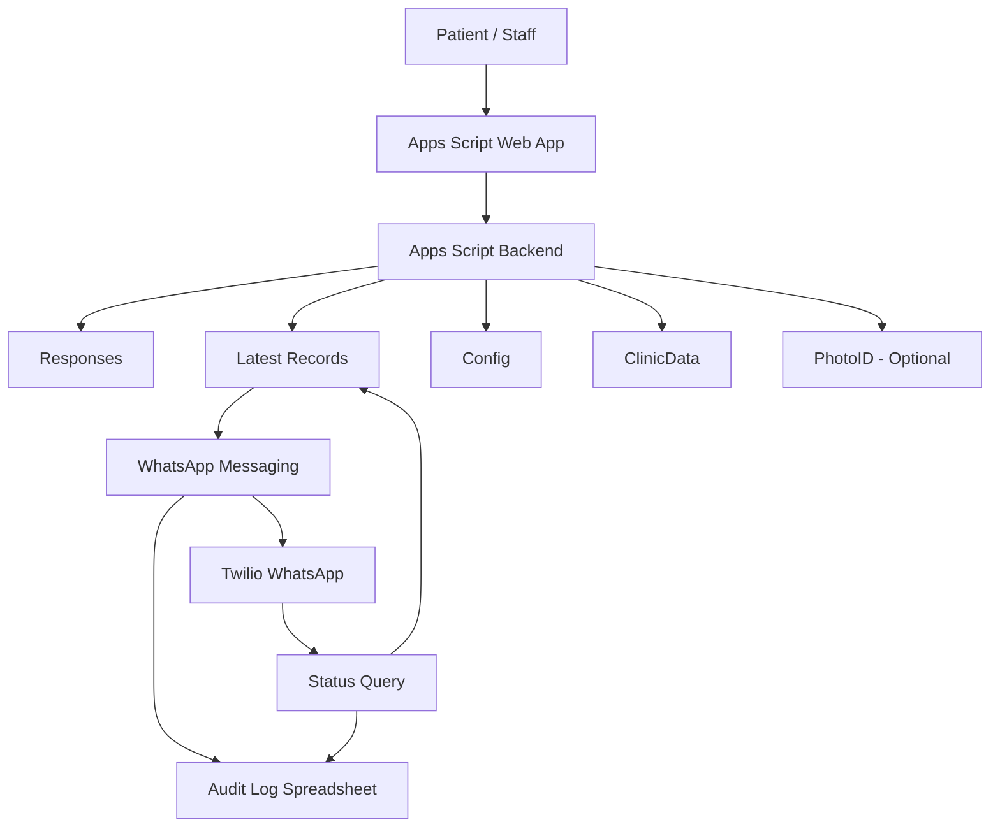

# Architecture

## Components

The implemented system combined a Google Apps Script web application, Google Sheets, Twilio WhatsApp, and Drive-based logs.

## Data responsibilities

### Responses
Stores raw feedback submissions.

### Latest Records
Maintains the newest record per phone number and includes messaging fields such as message ID and delivery status.

### Config
Stores operational settings including sheet names, column mappings, messaging settings, review URLs, batching values, and logging configuration.

### ClinicData
Stores branch and staff/doctor reference data used by the form.

### PhotoID
Optional reference data for staff/doctor images.

## Messaging integration

Twilio WhatsApp is used for message delivery and delivery-status lookup.

The messaging flow is driven from the spreadsheet/admin workflow rather than exposing provider credentials to end users.

## Logging

Send attempts and status refreshes are written to an append-only log spreadsheet in Drive to support troubleshooting and operational traceability.

## Deployment

The web app uses Apps Script deployment versioning. A prior deployment version can be re-selected for rollback if a newly deployed version causes problems.
