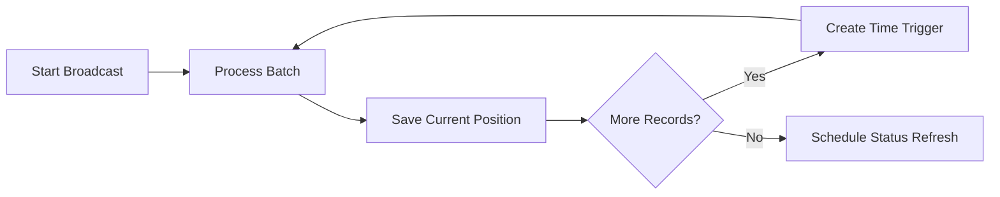

# Operational Design

## Admin workflows

The system supports two primary messaging modes:

- **Small runs** for quick, same-execution sends
- **Batched broadcasts** for larger recipient sets

It also provides operations for:

- refreshing delivery statuses;
- resetting batch progress;
- cancelling/rescheduling triggers;
- clearing message IDs/statuses when a controlled resend is required.

## Consent gating

Messaging is only attempted when consent is present in the latest record.

The implementation accepts configured affirmative values and checks whether a message has already been sent before proceeding.

## Batching

Large broadcasts are broken into smaller units.

Batch size, per-message delay, and inter-batch delay are configurable.

## Delivery status

After messages are sent, the system can query Twilio and update the corresponding delivery status in the working sheet.

This makes the spreadsheet both an operational interface and a lightweight status console.

## Logging

Operational activity is written to a separate log workbook.

This supports:

- send troubleshooting;
- status-refresh troubleshooting;
- operational auditability;
- support handover.

## Recovery

The support design includes explicit recovery tools because scheduled automation can fail for reasons such as provider limits, execution time, or configuration issues.

Examples include:

- reset batch progress;
- reset and cancel triggers;
- clear selected message identifiers/statuses;
- inspect Apps Script executions and logs.

## Error scenarios

The support guide specifically considers:

- provider rate limiting;
- messaging restrictions outside the allowed conversation window;
- mid-run stops caused by execution-time limits.

The batching design treats a controlled mid-run stop as resumable rather than as a complete workflow failure.
